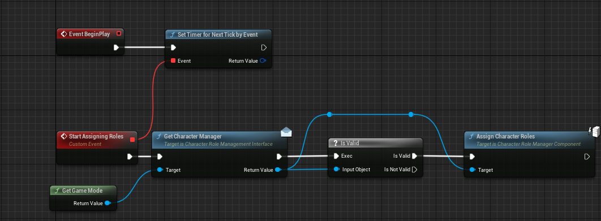

# Quick Setup Guide

## Reference Material

After installing the plugin through the Epic Launcher, you should have access to the Plugin Content which includes a few premade assets. These include a functional test, and some testing classes. These contain the bare minimum aspects to make the system work. 

This includes:

- Missable_RoleComponent (A BP example RoleComponent class)
- BP_RoleTest_GM (Example Game Mode, used for the Test map and has the [`CharacterRoleManagerComponent`](/Documentation/C%2B%2BClasses/Components/CharacterRoleManagerComponent/) attached with some preset values)
- BP_RoleTest (Example Actor which can Receive a Role, as they have a [`CharacterRegisterComponent`](/Documentation/C%2B%2BClasses/Components/CharacterRegisterComponent/) attached. It also implements the [`ICharacterRoleManagementInterface`](/Documentation/C%2B%2BClasses/Interfaces/ICharacterRoleManagementInterface/) for reference on how to do that)
- BP_CharacterRoleTest (The Functional Test, which also serves an example on how to trigger the Role Assignment)
- FTEST_CharacterRoles (The Map used in the Functional Test, but also an example on how to setup the level)

## Role Manager

Add the [`CharacterRoleManagerComponent`](/Documentation/C%2B%2BClasses/Components/CharacterRoleManagerComponent/) to the actor that you want to have Ownership over it. We would recommend having it on the Game Mode for the most seamless integration and usage. You can setup the Component by simply adding to the Character Roles Map: 

## Registering

To mark an actor for receiving a role, add the [`CharacterRegisterComponent`](/Documentation/C%2B%2BClasses/Components/CharacterRegisterComponent/) to it. This will handle the Registering process automatically. 

**Note** If you have placed the [`CharacterRoleManagerComponent`](/Documentation/C%2B%2BClasses/Components/CharacterRoleManagerComponent/) on an actor other than the Game Mode, you will need to make sure that the Owner of the [`CharacterRegisterComponent`](/Documentation/C%2B%2BClasses/Components/CharacterRegisterComponent/) implements the [`ICharacterRoleManagementInterface`](/Documentation/C%2B%2BClasses/Interfaces/ICharacterRoleManagementInterface/) and the `GetCharacterManager()` function returns the right component.

## Assignment

After all the Actors have been registered, it is safe to call the `AssignRoles()` function on the [`CharacterRoleManagerComponent`](/Documentation/C%2B%2BClasses/Components/CharacterRoleManagerComponent/). We are currently working on a dynamic role assignment system, to allow assignment without requiring every registered actor to be reassigned. You can check our future LTS features on our [Plugin Roadmap](/PluginRoadmap) 

This action can only done when the Owning actor has Authority, which does not mean it is a RPC but rather that the execuution has to be on the Server for it to be called. 

The [`CharacterRoleComponent`](/Documentation/C%2B%2BClasses/Components/CharacterRoleComponent/) that is assigned will be automatically spawned in, so you don't have to worry about that. 

